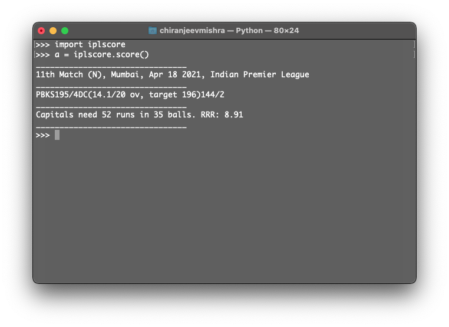

# IPLSCORE

This is a library which is made for fun and getting ipl score while working 

Developed by Chiranjeev Mishra

## Example of How to use it 

```python
import iplscore
//create an object of class score and here you go 
a = iplscore.score()
```

## OUTPUT


checkout : https://pypi.org/project/iplscore/
